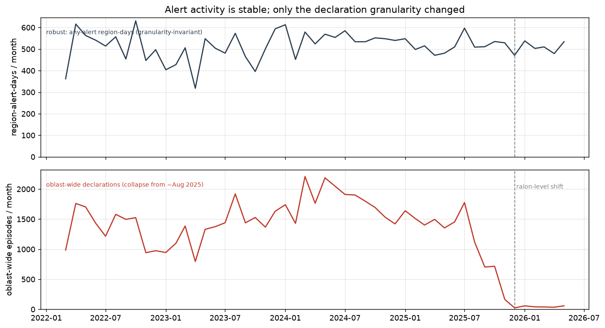
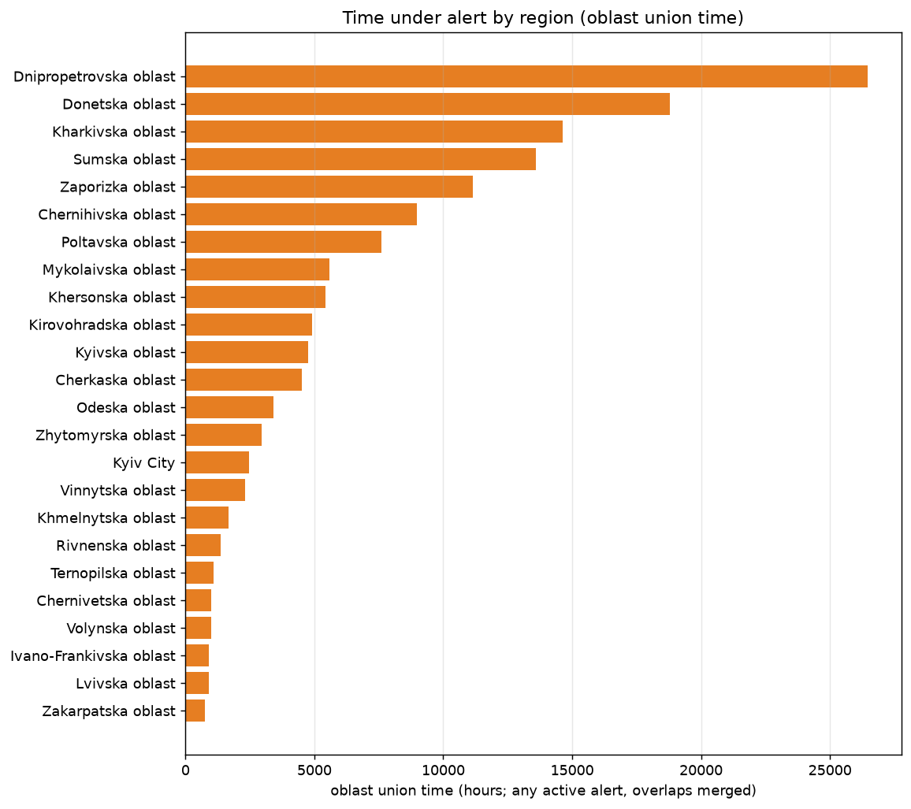
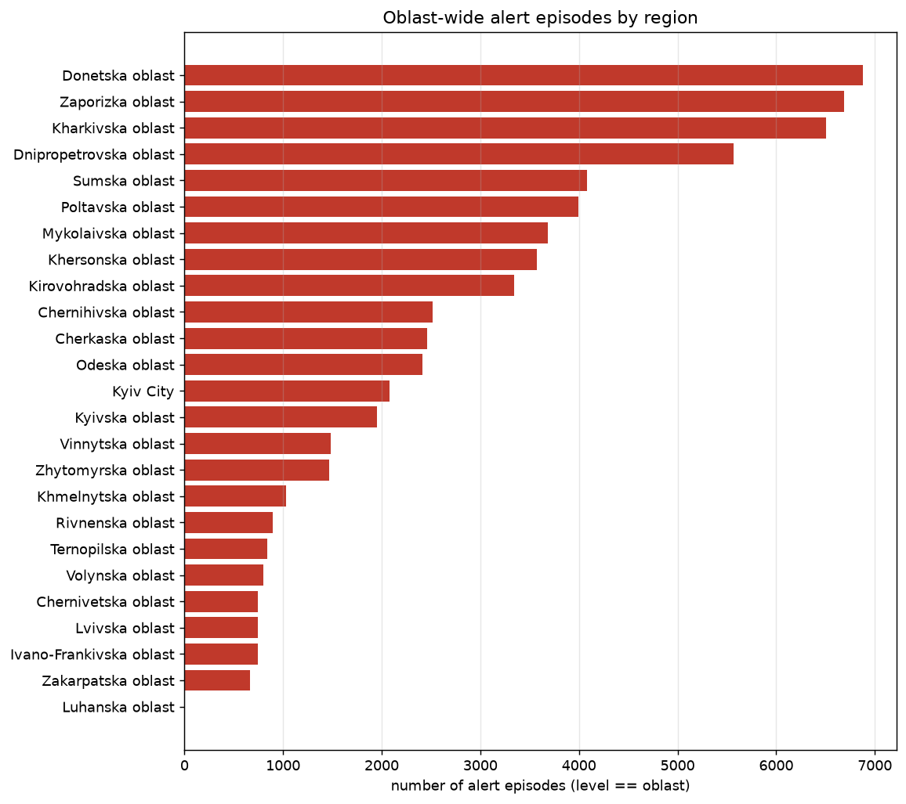
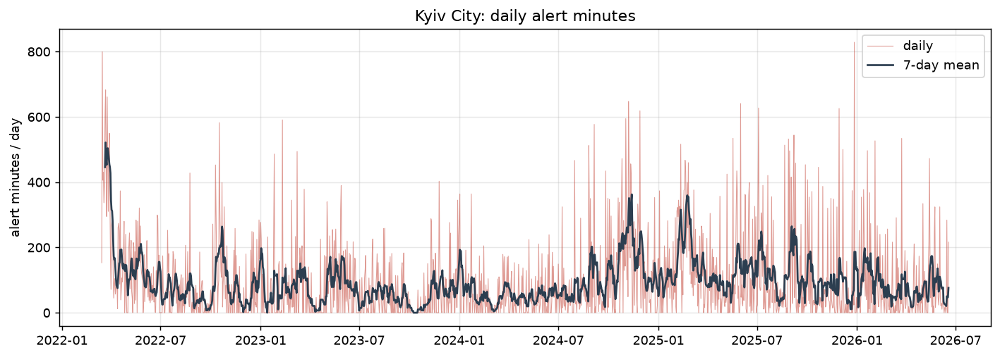
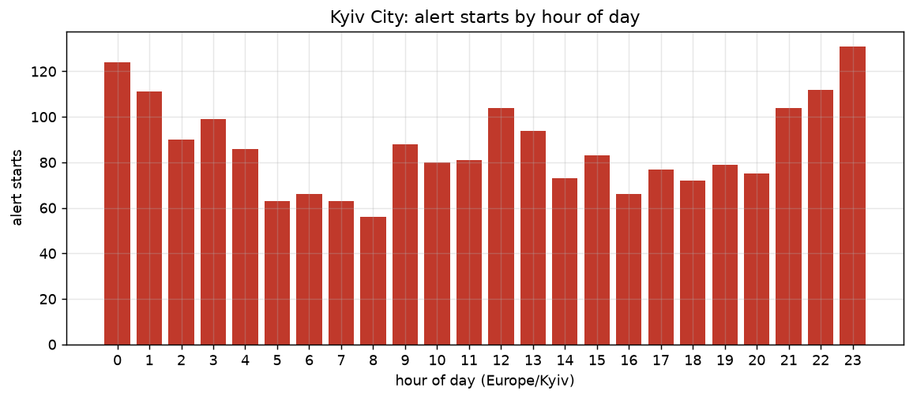
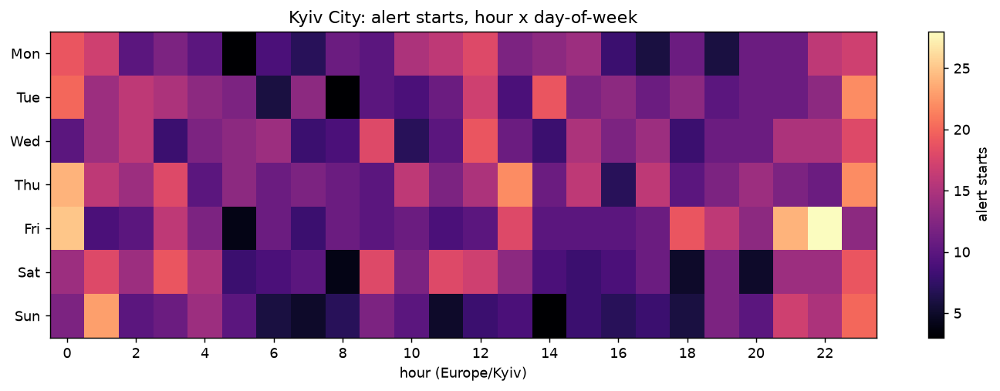
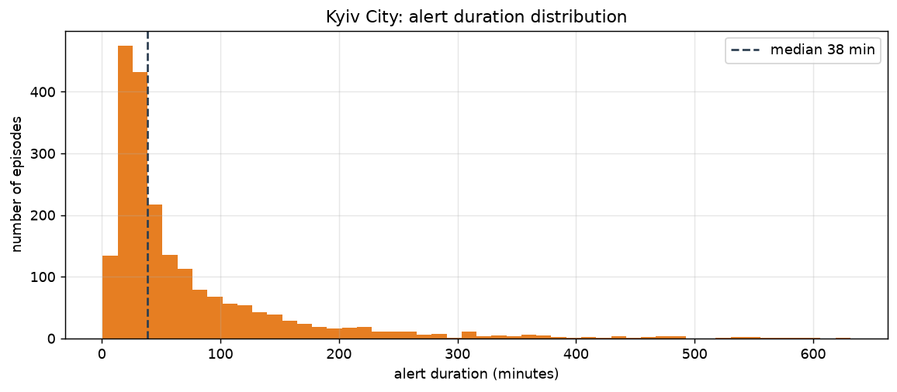
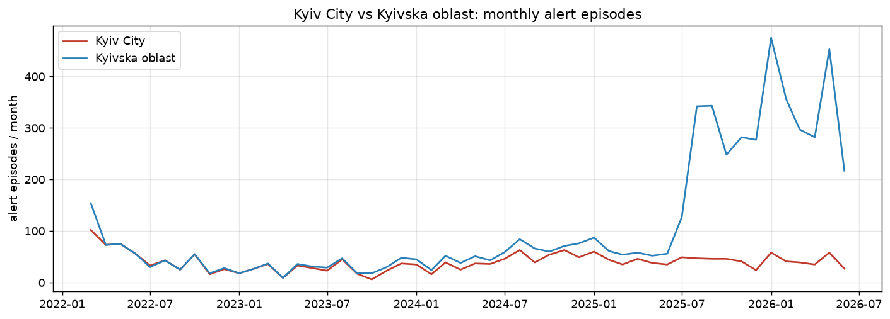

# Ukraine Air-Raid Alerts — Time Series Analysis

> ⚠️ **Disclaimer.** This is a **research / educational** project that analyses
> *historical patterns* of air-raid **alert declarations** in Ukraine. It is
> **NOT** an official alerting system and **must not** be used for operational,
> safety, or evacuation decisions. It does **not** predict attacks. An *alert*
> (тривога) is an administrative warning signal — **not** a physical strike;
> attacks are adversarial and inherently unpredictable. Always rely on official
> channels (e.g. official government apps, local authorities).

## What this is / is not

- ✅ Retrospective EDA of alert patterns (hour-of-day, weekday, seasonality, duration).
- ✅ A transparent, **baseline-first** forecasting experiment of *alert activity*.
- ❌ Not an early-warning system. ❌ Not attack prediction. ❌ Not safety-critical.

## Scope

The current forecasting MVP focuses on **Kyiv City** (a clean, well-balanced
unit). EDA is performed at the **national level across all available Ukrainian
regions**, with an explicit comparison between **Kyiv City** and **Kyiv Oblast**
as distinct units. The pipeline is **parameterised** (`config.TARGET_REGION`)
and **can be extended to other regions**; multi-region modelling is planned as
**future work**.

*Why Kyiv City for the model?* The primary target is binary (`has_alert_next_day`).
At the national level "any alert somewhere in Ukraine tomorrow" is almost always
*yes* (degenerate); for quiet regions it is almost always *no*. Kyiv City sits in
the class-balance sweet spot, so the classification task is meaningful.

## Data

- **Source:** [Vadimkin/ukrainian-air-raid-sirens-dataset](https://github.com/Vadimkin/ukrainian-air-raid-sirens-dataset),
  file `datasets/official_data_en.csv` (**official** source only).
- **Pinned commit:** `dac507f80fe59ef62d67e80be1e6b9558f126b33`, retrieved 2026-06-20.
- **Size:** 271,160 alert events · 2022-03-15 → 2026-06-20 · 25 top-level regions.
- **Columns:** `oblast, raion, hromada, level, started_at, finished_at, source`.
- **Timezone:** timestamps are stored in **UTC**; converted to **Europe/Kyiv**
  (with DST) for all local-time analysis.
- **License:** not stated upstream; attributed to the dataset author and used
  *as-is* for research/education.
- **Volunteer data is intentionally excluded** from the MVP: it has a different
  schema (region-level only) and an imputed `naive` flag — `naive=True` records
  use a placeholder end time of *start + 30 min* (the real end was not observed),
  which would corrupt duration analysis. (Note: this dataset `naive` flag is
  unrelated to the *naive baselines* used in modelling — see Methodology.)

### Data quality (found during cleaning)

`src/clean.py` surfaces and handles three real issues in the upstream snapshot,
all reported by `py -m src.pipeline`:

- **~42% exact-duplicate rows** (113,845 of 271,160) — identical
  `unit + start + end`. Deduped → 157,315 canonical events. Likely an artefact of
  how the upstream repo is regenerated; **deduping is essential**.
- **Implausibly long alerts** (686 events > 24 h, up to ~604 days) — concentrated
  on front-line hromadas (Dnipropetrovska, Donetska, Zaporizka), almost all at
  raion/hromada level. Flagged via `is_long_alert` (not dropped) and excluded from
  duration-based EDA. **Kyiv City has none**, so the MVP target is unaffected.
- After deduping: **no overlaps within an exact unit**, and **no censoring** in
  this snapshot (every alert has a recorded end). The pipeline still handles both
  for robustness.

## Reproducibility

- Python ≥ 3.11 (uses the stdlib `zoneinfo`). Install deps:
  `pip install -r requirements.txt`.
- The raw snapshot is **not committed**. `src/data_loader.py` fetches it from the
  pinned commit and verifies it against the SHA-256 recorded in
  [`data/meta.json`](data/meta.json) (`a36eb2fa…ab7d58`).
- Fixed `RANDOM_SEED = 42` (`src/config.py`).
- Smoke test the data layer: `py -m src.data_loader`.

## Dashboard (exploratory, Phase 3A)

An interactive Streamlit explorer for the processed tables — overview, national
breakdown, Kyiv City patterns, and a Kyiv City vs Kyiv Oblast comparison. It is
**exploratory only** (no model). Build the data first, then run locally:

```bash
python -m src.pipeline       # writes data/processed/*.csv
streamlit run streamlit_app.py
```

If the processed CSVs are missing, the app shows a message asking you to run the
pipeline first.

## Project structure

```
.
├── README.md
├── requirements.txt
├── streamlit_app.py         # exploratory dashboard (Phase 3A)
├── LICENSE                  # MIT (project code); dataset license: see Data
├── data/
│   ├── raw/                 # pinned snapshot (git-ignored, fetched by loader)
│   ├── processed/           # generated event/daily/hourly tables (git-ignored)
│   └── meta.json            # source, pinned commit, SHA-256, row count
├── src/
│   ├── config.py            # single source of truth (regions, paths, TZ, seed)
│   ├── data_loader.py       # fetch + verify pinned snapshot (no analysis)
│   ├── clean.py             # raw -> canonical event-level table
│   ├── aggregate.py         # event -> daily / hourly tables (per region)
│   ├── features.py          # past-only supervised features (post-split)
│   ├── baselines.py         # persistence / rolling-mean / seasonal-naive
│   └── evaluate.py          # chronological split + metrics
├── notebooks/               # 01_eda, 02_modeling
└── figures/                 # saved plots
```

## Methodology

- **EDA:** national overview (all regions) + Kyiv City hourly patterns
  (hour-of-day, `hour × weekday` heatmap, durations) + Kyiv City vs Kyiv Oblast.
- **Regional "time under alert" (level-aware):** a region holds alerts at
  oblast/raion/hromada level. Summing every episode ("row-sum") **overcounts**
  time when sub-areas are alerted in parallel (~1.8–2.5× in front-line oblasts);
  oblast-level-only **undercounts** the raion era. The dashboard defaults to
  **union time** (wall-clock time during which ≥1 alert is active in the region),
  the only measure comparable across the Dec-2025 oblast→raion shift. Kyiv City
  is single-level, so this does **not** affect the MVP target.
- **Target (daily, Kyiv City):** primary `has_alert_next_day` (classification);
  optional `alert_minutes_next_day` (regression).
- **Naive baselines:** persistence (*yesterday*), 7-day rolling mean,
  same-weekday-last-week.
- **Models:** `LogisticRegression` / `HistGradientBoosting` (deliberately simple).
- **Evaluation:** chronological split / `TimeSeriesSplit`.
  Classification — F1, ROC-AUC, Brier (+ base rate). Regression — MAE, RMSE.
  Always reported against the baselines.
- **Leakage controls:** chronological (never random) split; past-only features
  built *after* the split; `finished_at`/duration never used as a next-day feature.

## EDA findings

Figures are generated by `python -m src.eda` (saved in `figures/`). These describe
alert **declarations / activity**, *not* attacks or shelling.

1. **Alert activity is stable; only the declaration granularity changed.**
   "Region-alert-days" (distinct region×day with an alert) held ~480–540/month
   across 2022–2026, while *oblast-wide* declarations collapsed from ~1,800/month
   (mid-2025) to a few dozen as the system moved to **raion-level** alerts
   (~Aug–Nov 2025). Apparent drops in oblast-wide counts reflect granularity, not
   fewer alerts.
2. **Front-line regions dominate time under alert.** By oblast union time,
   Dnipropetrovska (~26,500 h), Donetska (~18,800 h) and Kharkivska (~14,600 h)
   lead. The ranking differs from simple episode counts — metric choice matters.
3. **Kyiv City: frequent but short.** ~70% of days have ≥1 alert (base rate
   0.703); median alert duration ≈ 38 min.
4. **Kyiv City: diurnal/weekly structure.** Alert starts peak in the late
   evening/overnight (busiest start hour ≈ 23:00; ~28% of starts fall in
   00:00–06:00), visible as bands in the hour×weekday heatmap.
5. **Kyiv City and Kyiv Oblast behave differently** month to month — confirming
   they must be treated as independent units.

### National




### Kyiv City





### Kyiv City vs Kyivska oblast


### Methodology notes
- **alert episode count** = number of cleaned alert intervals (after dedup +
  in-unit overlap merge).
- **all-level row-sum** of hours can **overcount**: parallel raion/hromada alerts
  multiply hours (~1.8–2.5× vs union in front-line oblasts), so it is not used for
  ranking.
- **oblast union time** = wall-clock time during which ≥1 alert is active in the
  oblast (overlaps across levels merged). This is the **default** metric for
  comparing regions and is comparable across the granularity shift.
- the **monthly trend** uses *region-alert-days* (distinct region×day) as a
  granularity-invariant activity measure.

## Results

_TBD — populated after modelling._

## Limitations

- Alerts ≠ attacks (administrative signal).
- Non-stationarity: war intensity and tactics change over time.
- Right-censoring of alerts still ongoing at the snapshot boundary.
- Upstream ingestion delay — the dataset is **not real-time**.
- Granularity shift: increasingly raion-level alerts since Dec 2025.

## Future work

- Multi-region modelling (pipeline already parameterised via `config.TARGET_REGION`).
- Hourly classification (class imbalance + block-aware CV).
- Incorporate the volunteer dataset (after handling `naive` imputation) for
  earlier coverage (Feb–Mar 2022) and cross-source validation.
- Automation: scheduled refresh of the pinned snapshot + a live dashboard.

## References

- Related work: *Predictive Analytics of Air Alerts in the Russian-Ukrainian War*
  ([arXiv:2411.14625](https://arxiv.org/abs/2411.14625)).

## Development

Built using AI (Claude) as the primary engineering tool; the full AI interaction
log is part of the submission, as required by the assignment.

## License

Project code: **MIT** (see [`LICENSE`](LICENSE)). Dataset: © its authors
(see the **Data** section).
